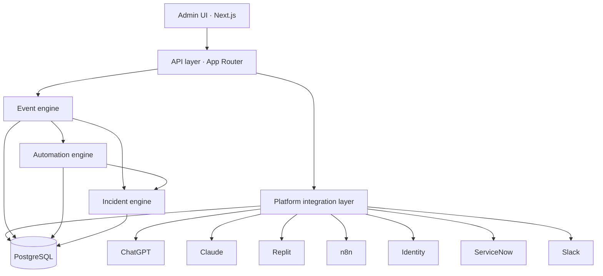

# AI Platform Operations & Reliability Orchestrator

A production-style portfolio implementation demonstrating enterprise AI platform operations, integrations, reliability engineering, and workflow automation.

This application is the operational layer above ChatGPT Enterprise, Claude, Replit, n8n, Microsoft Entra ID, ServiceNow, and Slack. It normalizes platform events, watches connector health, detects integration failures and configuration drift, opens incidents, runs automated remediation, and produces operational reporting.

It is not an AI governance, DLP, or security-operations product. Those concerns belong to a complementary control plane. This product answers a different question:

**Can an enterprise reliably operate, integrate, monitor, and automate its AI platforms at scale?**

---

## Why it exists

Enterprises do not run one model in a vacuum. They run several AI platforms, an identity provider, a ticketing system, and an automation fabric. Failures are operational: a Claude error-rate spike, an n8n workflow that does not acknowledge, a drifted sharing setting, a SCIM job that stalls.

This repo is a working model of that operations practice:

- Connector APIs instead of hardcoded vendor screens
- A normalized event pipeline
- Incident lifecycle with automated remediation
- Configuration baselines and change management
- n8n as a first-class automation system
- A Simulation Center that mutates real application state

Vendor credentials are not required. Connectors use realistic health, configuration, and action surfaces, but the backend, database, APIs, and workflow engines are real.

---

## Architecture



### Connector architecture

Every platform implements `PlatformConnector`:

`getHealth`, `getUsers`, `getUsage`, `getConfiguration`, `testConnection`, `getEvents`, `executeAction`.

`ChatGPTConnector`, `ClaudeConnector`, `ReplitConnector`, and `N8nConnector` share a connector adapter over the application database. Identity, ServiceNow, and Slack use the same interface against the `Integration` model. Adding Gemini later means registering another connector, not rewriting pages.

### Event architecture

Inbound vendor webhooks, connector tests, simulations, and n8n callbacks all pass through `ingestEvent`. Events are normalized (`id`, `timestamp`, `platform`, `type`, `severity`, `payload`, `correlationId`, `processingStatus`) and then processed by the incident, drift, and automation engines.

### Database architecture

Prisma models cover users, platforms, integrations, health snapshots, events, incidents, workflows, configuration baselines/snapshots/drift, change requests, runbooks, automations, notifications, vendor escalations, and audit events. Relationships are real: incidents belong to platforms, remediations write timeline rows, configuration fixes write snapshots and audit records.

Local development uses SQLite so the demo starts without Docker. `docker-compose.yml` still includes PostgreSQL and n8n for a production-shaped companion stack.

### Automation architecture

The in-process remediation engine plans actions from event type (retry, restart workflow, fail over, reconnect, notify, escalate, health-check) and executes them through the connector interface. Example n8n workflows in `/workflows` express the same paths as importable graphs.

---

## Technology stack

| Layer | Choice |
| --- | --- |
| Frontend | Next.js App Router, React, TypeScript, Tailwind CSS, Lucide, Recharts |
| Backend | Next.js route handlers, Zod validation, structured logging |
| Database | SQLite by default for local demo; PostgreSQL via Docker Compose for a production-shaped setup |

| Automation | n8n workflow JSON plus an in-process engine |
| Infrastructure | Docker Compose, `.env.example` |
| Tests | Vitest (unit / API catalog), Playwright (critical flows) |

---

## How to run locally

Requires Node.js 22+. Docker is optional (PostgreSQL + n8n).

```bash
cp .env.example .env
npm install
npx prisma generate
npx prisma db push
npx tsx prisma/seed.ts
npm run dev
```

The default `DATABASE_URL` is a local SQLite file (`prisma/dev.db`) so the app runs without Docker. Open [http://localhost:3000](http://localhost:3000).

## Deploy to Vercel

Import the GitHub repo and deploy. Do not add environment variables or a hosted database. The build seeds a SQLite demo database and bundles it with the app.

The ESLint deprecation, `package.json#prisma` notice, and Prisma “update available” banner during install are warnings, not failures.

PostgreSQL + n8n (optional):

```bash
docker compose up -d postgres
# then set DATABASE_URL to the Compose Postgres URL and switch
# prisma/schema.prisma `provider` to `postgresql` before `db push`.
docker compose --profile full up --build
```

---

## Environment variables

See `.env.example`. Nothing secret is committed.

| Variable | Purpose |
| --- | --- |
| `DATABASE_URL` | SQLite file or PostgreSQL connection string |
| `DEMO_MODE` | Allows unsigned webhooks for local testing |
| `DEMO_OPERATOR_EMAIL` | Signed-in operator used by write APIs |
| `WEBHOOK_SECRET` | HMAC secret for inbound n8n / vendor callbacks |
| `N8N_BASE_URL` / `N8N_API_KEY` | Optional live n8n |
| `OPENAI_API_KEY` / `ANTHROPIC_API_KEY` | Optional live connectors; empty uses built-in connectors |
| `API_RATE_LIMIT_PER_MINUTE` | Basic per-client rate limit |

---

## n8n setup

Documented in [`workflows/README.md`](workflows/README.md).

1. Platform Health Alert — health check → threshold → webhook → notification → incident
2. Failed Workflow Recovery — failure event → retry → verify → incident if still failing
3. Configuration Drift — drift webhook → change request → notify → remediate after approval

The in-process engine executes the same lifecycle without n8n so local use does not depend on another container.

---

## API documentation

The in-app catalog lives at `/docs` and `GET /api/docs`.

Notable routes:

- `GET /api/platforms`
- `GET /api/platforms/:slug/health`
- `POST /api/platforms/:slug/test`
- `GET` / `POST /api/incidents`
- `POST /api/events`
- `POST /api/webhooks/:provider`
- `GET /api/workflows` · `POST /api/workflows/:slug/execute`
- `GET /api/configuration/:platform` · `POST /api/configuration/:platform/remediate`
- `POST /api/simulation/outage` · `POST /api/simulation/recovery`

Requests are validated with Zod. Write actions require the demo operator to be an `ADMIN` or `OPERATOR`. Webhooks are HMAC-signed unless demo mode is on.

---

## Simulation examples

The top banner and `/simulation` mutate database state. They are not UI-only toggles.

| Action | What actually happens |
| --- | --- |
| Simulate Claude outage | Error rate 0.22% → 18%, status Degraded, `platform.api_error` ingested, incident opened, remediation executed, notifications written |
| Simulate workflow failure | n8n workflow event, retry, incident if still failing |
| Simulate configuration drift | Observed `external_sharing` becomes Enabled, drift record opened |
| Simulate recovery | Platforms return to baseline, open incidents resolve, timeline updated |

Reset restores the seeded operational dataset.

---

## Screenshots

Run the app and capture:

1. Overview — light product surface, platform cards, activity timeline
2. Platform detail — ChatGPT health, Test connection
3. Incidents — active queue and lifecycle actions
4. Simulation Center — Claude outage moving live metrics
5. Configuration — expected vs observed, remediate

---

## Design decisions

- **Light, not SOC.** The complementary governance product is dark and dense. This operations console is bright, spacious, and product-like so the two portfolios do not collapse into one dashboard aesthetic.
- **Top navigation.** Operations work is a small set of verbs (operate, integrate, recover), not a control-room of nested modules.
- **Connectors over screens.** UI never talks to ChatGPT, Claude, Replit, or n8n directly. Pages call APIs; APIs call `getConnector(slug)`.
- **Simulation is a first-class subsystem.** Recruiters can watch the operational lifecycle without credentials.
- **n8n is documented and optional.** The JSON workflows are real importable graphs; the in-process engine keeps the demo honest when n8n is not running.

---

## Tests

```bash
npm test
npx playwright install chromium   # once
npm run test:e2e                  # app must be able to boot
```

Unit tests cover event normalization, incident lifecycle, drift comparison, remediation planning, SLO math, and webhook signatures.

---

## Future improvements

- Swap built-in connectors for live OpenAI / Anthropic / n8n clients behind the same interface
- Persist operator sessions with a real identity provider
- Add multi-region health probes and error-budget burn alerts
- Stream events to the UI over SSE
- Export reliability reports for QBR / vendor reviews

---

Seeded operators use fictional `@example.com` identities. No real employee names or confidential firm data are used.
